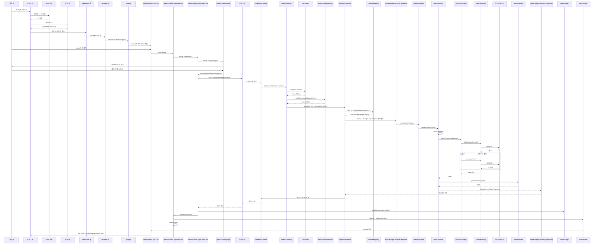

English🗺️

# **RollingKorea Project**
- An API that provides historical sites in Korea for foreigners.
- Development Period: 15 December 2024 – present 
- Team Members: 1 person 

- Swagger documentation is in progress ->

# Tech Stack
- **Language**: Java 
- **Framework**: Spring 6.2.1 / Spring Boot 3.4.1 
- **JDK**: 21 
- **Build Tool**: Gradle 
- **Database**: MySQL  
- **Server**: Local  
- **CI/CD**: In progress 

# Project Structure
--To be determined

# ERD

# Features
The features are described simply so that non-developers can easily understand what functionalities are available. 
For detailed information, please refer to the sequence diagrams below.

Users

- Sign-up and login through the website
- Social login (Google) authentication
  - The front-end sends the login social type for processing. Example: NO_SOCIAL / GOOGLE

Historical Sites

- View historical sites information
- Search for historical sites

My Page

- View and edit user profile

Ranking

- Ranking batch execution every Monday morning
- View top10-ranked historical sites based on user's likes.

Comments

- Create comments
- Edit and delete own comments
- Like and reply to comments
- ADMIN can also delete any comments

Replies

- Create nested replies to comments
- Edit and delete own replies
- ADMIN can also delete any replies

# Sequence Diagram
Login 
%%{init: {
  'themeVariables': {
    'fontSize': '16px',
    'actorFontSize': '16px',
    'noteFontSize': '14px'
  }
}}%%

Test Execution Status

Technical Challenges

Troubleshooting

Lessons Learned & Error Handling

Study Notes

Errors

Reflections on the Project

Korean🗺️

# **RollingKorea Project**
- 외국인들에게 한국의 역사적 명소를 제공하기 위한 API 입니다.
- 개발 기간 : 24.12.15 ~ now 
- 참여 인원 : 1명 

- Swagger 문서는 준비중입니다 ->

# 기술 스택
- **Language**: Java 
- **Framework**: Spring 6.2.1 / Spring Boot 3.4.1 
- **JDK**: 21 
- **Build Tool**: Gradle 
- **Database**: MySQL  
- **Server**: Local  
- **CI/CD**: 준비중 

# 프로젝트 구조
--예정

# ERD

# 기능설명
개발자가 아닌, 누구나 어떤 기능이 있는지 확인할 수 있도록 간단히 작성했습니다. 
기능에 대한 상세내용은 아래의 시퀀스 다이어그램을 확인부탁드리겠습니다.

회원

- 사이트를 통해 회원 가입 및 로그인
- 소셜 로그인(구글) 인증 후 로그인
  + 프론트에서 로그인 소셜 타입을 전달받아 사용 EX ) NO_SOCIAL / GOOGLE

유적지

-

마이페이지

랭킹

- 월요일 오전마다 랭킹 배치 수행

코멘트

- 코멘트 생성

댓글

- 대댓글 생성
  + ADMIN 도 삭제 가능

# 시퀀스 다이어그램
각 서비스마다 자세히 flow 를 나타내기 위해 작성했습니다.(준비중) 

# 테스트 진행 여부

< src = https://www.notion.so/19365f59b80881b19becf3e79a247028?v=19365f59b8088179a63a000ca0099981&pvs=4>

# 기술적 도전

# 트러블 슈팅

# 프로젝트를 진행하면서 학습한 내용과 에러 조치

# 학습 내용정리

# ERROR

# 프로젝트를 하면서 느낀 점

